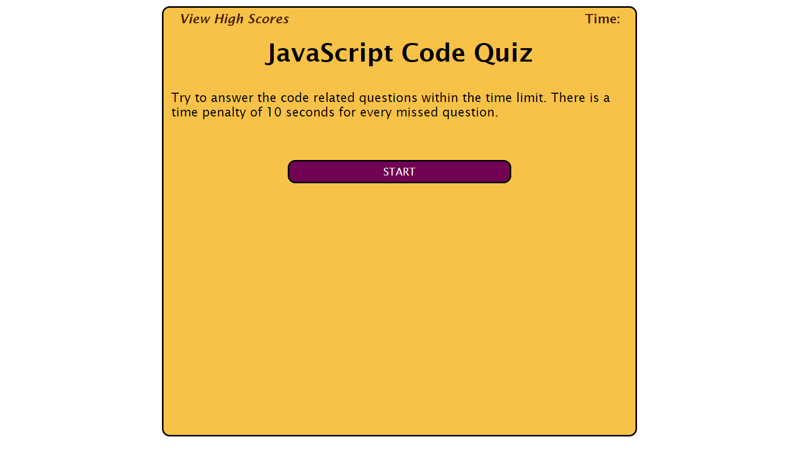
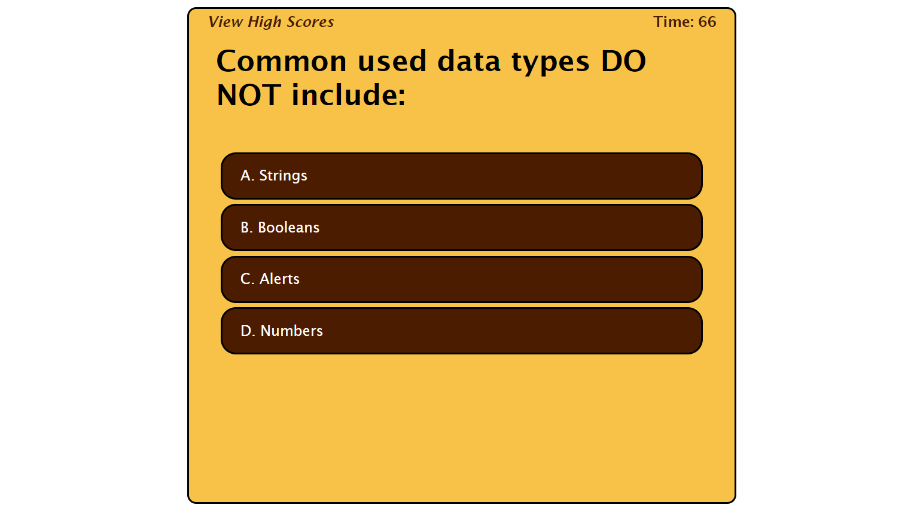
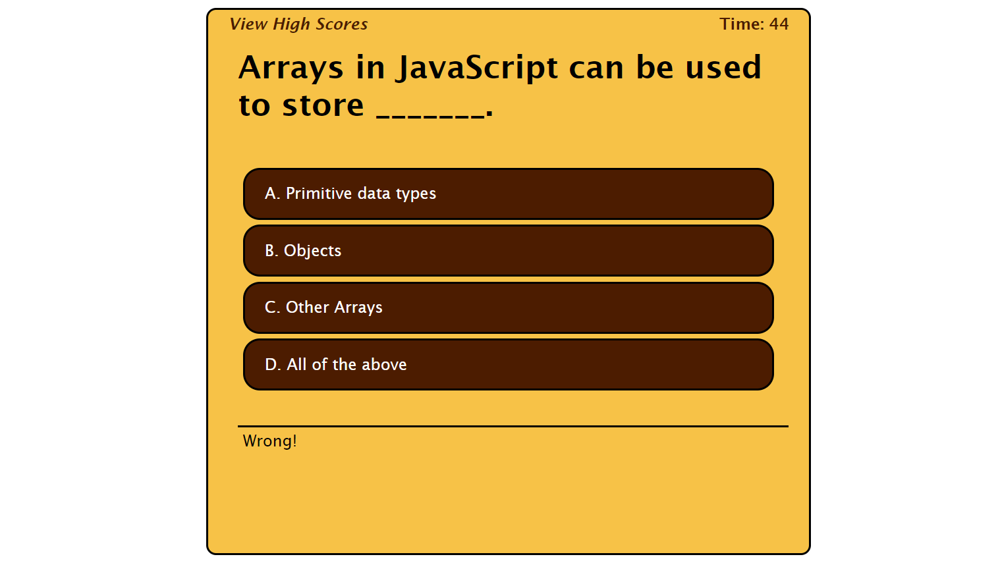
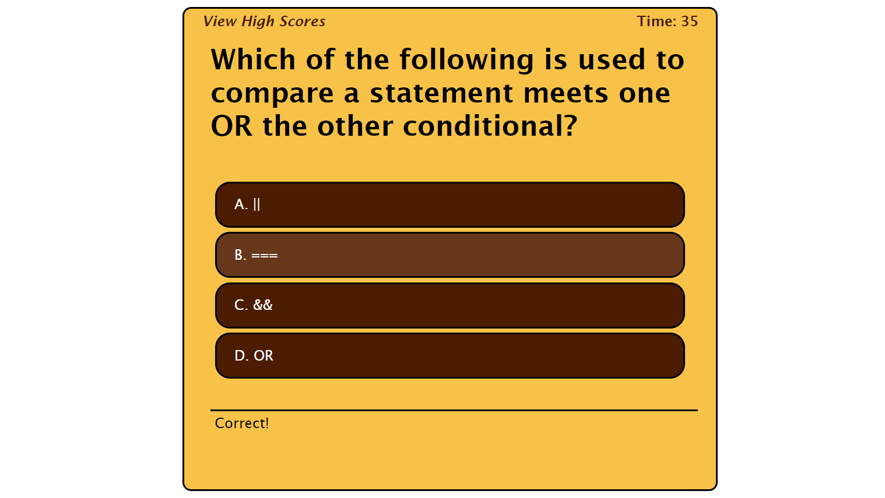
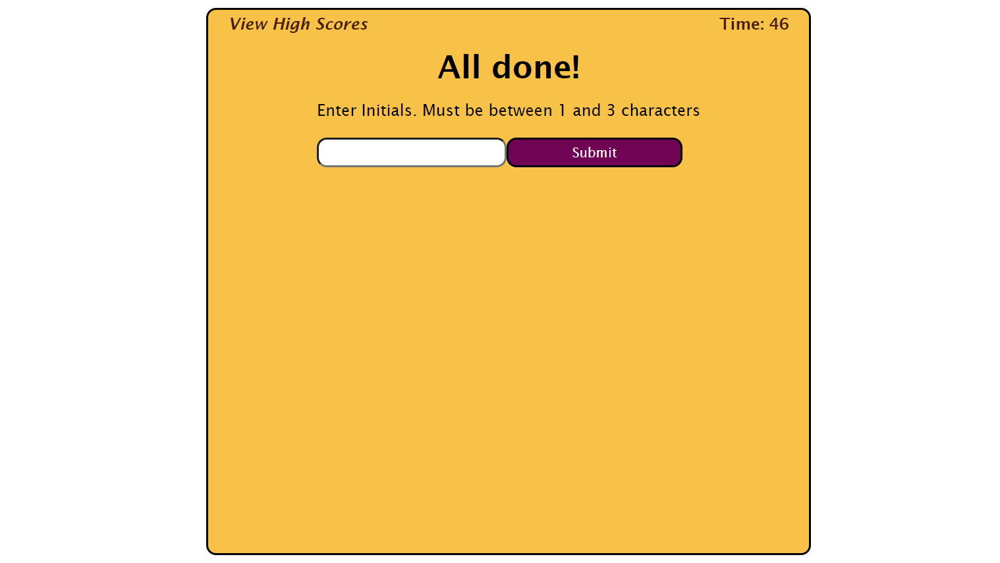
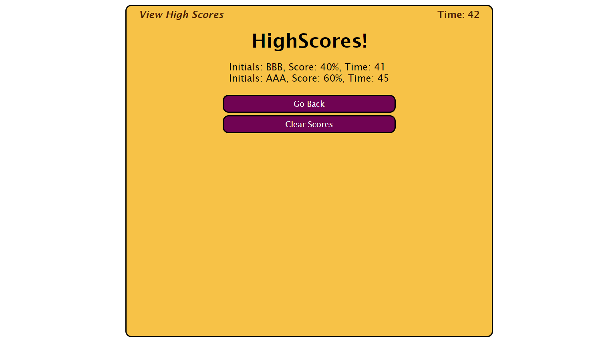
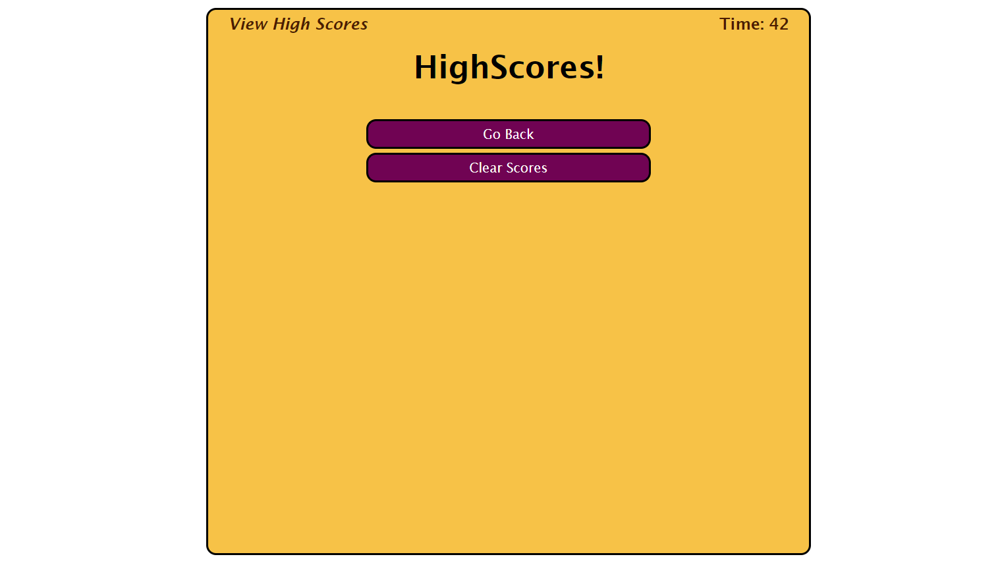

# <Javascript-Code-Quiz>

## Description

- The goal was to take a timed quiz on JavaScript fundamentals that stores high scores
- I built this project to practice web api develpoment
- This allows the user to interact with web page in a less intrusive way than using Alerts, Prompts, and Confirms
- I learned how to push and pull information to and from the browsers local storage
- I learned how to recursively empty an html 'container' using a js function.

## Usage

[Link to Deployed Application](https://andrewmuhn.github.io/code-quiz/)

- Click 'START' button

- Answer the questions by clicking on the answer you think is correct

- If you get a question wrong:
	- 'Wrong!' will appear beneath the next answers
	- 10s will be removed from the timer

- If you get the question right:
	- 'Correct!' will appear beneath the next answers

- If the timer runs out or you answer all the questions you be prompted to enter your initials to save your score. You must press submit to save your score.

- After submitting your initials or clicking the 'View High Scores' text from any screen you will be taken to a list of saved highscores. 

- You can clear the whole highscore list by hiting  the 'Clear Scores' button. If you hit the 'Go Back' Button you'll be taken back to the start screen and can retake the quiz.

## Credits

Project of Andrew Muhn

Completed as part of EdX bootcamp

## Tests

- If user lets time run out after starting the test:

		-Expected result: UI takes you to the page to enter your initials to save your score.

- I user enters there initials with 0 characters or more than 4:

		-Expected result: nothing happends.